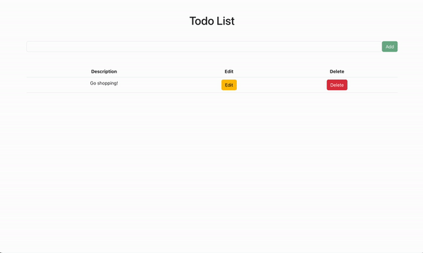
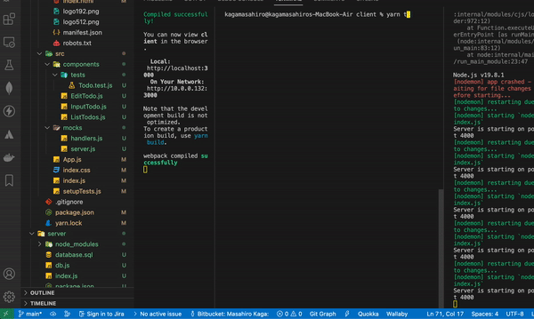

<h1 align="center">
Todo app - Assignment
</h1>
<h3 align="center">
Masahiro Kaga
</h3>

 

## How to setup and run the app on your local
Open the terminal, then follow the procedures below.
- In advance, to install [yarn, postgres] are necessary on your local.
- Start Postgres database service with running the command 'psql postgres'.
- Create database and table with commands. The commands were written at /server/database.sql file.
- Go to the client directory on your terminal and run 'yarn start', then it runs on port 3000.
Then, change the value on /server/db.js file. "user" should be the name which you set up on Postgres when you installed it. If you already set up the password, enter the password too.

 

## Features of app

- PERN stack.(Postgres, Express, React and Node.js)
- Use yarn as a package manager.
- Responsive design.

 

## Tasks and Progress

### &emsp;Task 1 : Complete 

&emsp;&emsp;[Frontend]  

1. Create react app with yarn.  
2. Deleted unnecessary files.
3. Embeded CDN of Bootstrap for UI.
   
&emsp;&emsp;[Backend]  

1. Install necessary libraries with yarn.(express, pg, cors, nodemon)
2. Download Postgres with using Homebrew on my local:Mac.
3. Start Potgres, create/connect DB and create table.

### &emsp;Task 2 : Complete  

&emsp;&emsp;[Backend]  

1. Test HTTP requests(CRUD) with using Thunder Client which is an extension of Visual Studio Code(similar function as a Postman)

&emsp;&emsp;[Frontend]  

1. Confirm HTTP requests work from UI.  

### &emsp;Task 3 : Incomplete

1. Install MSW for mock.
2. Run test. Get works fine, but fail Post and Delete.
3. Lack of server side test.

 

## Demo

 

1. HTTP requests

    

 

2. Unit test

    

 

 

## Difficulties

- PostgreSQL - It is my first time trying, therefore I quickly learnt it on Youtube before starting assignment.
- Unit test - About Jest, React Testing Library and MSW(Mock Service Worker), I should get more knowledge and skills on how to handle it. Eventually, I could not complete this task as I could not cope with POST and DELETE for the test.
- Typescript - This time, I did not use it due to time consuming. I should learn and get used to it.
- Also I needed to add JSDoc and Containerizing features.
